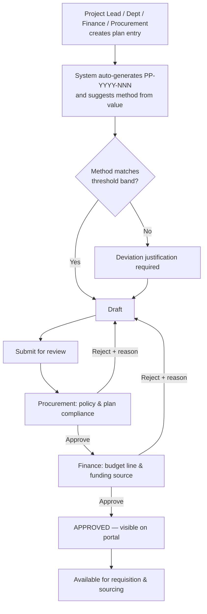
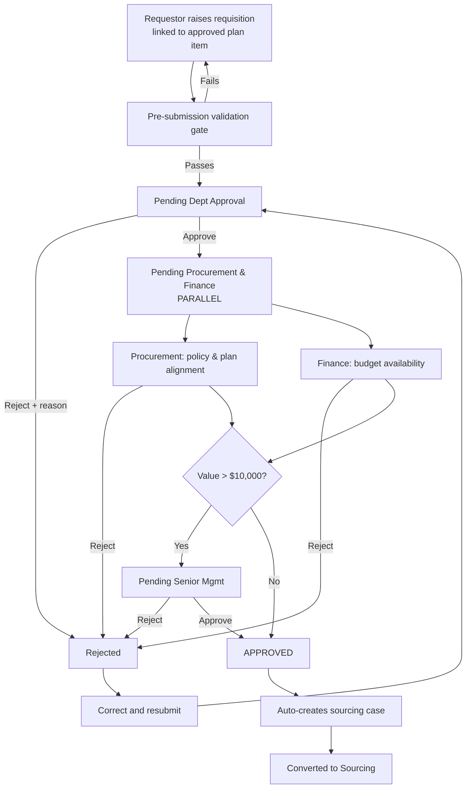
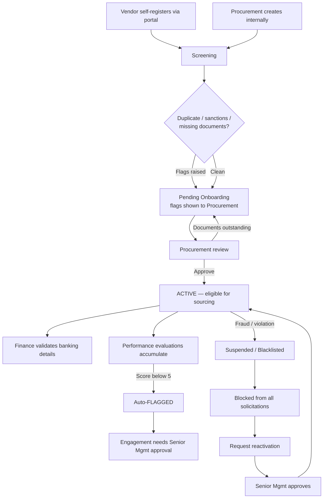
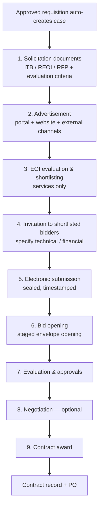
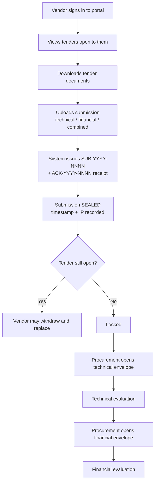
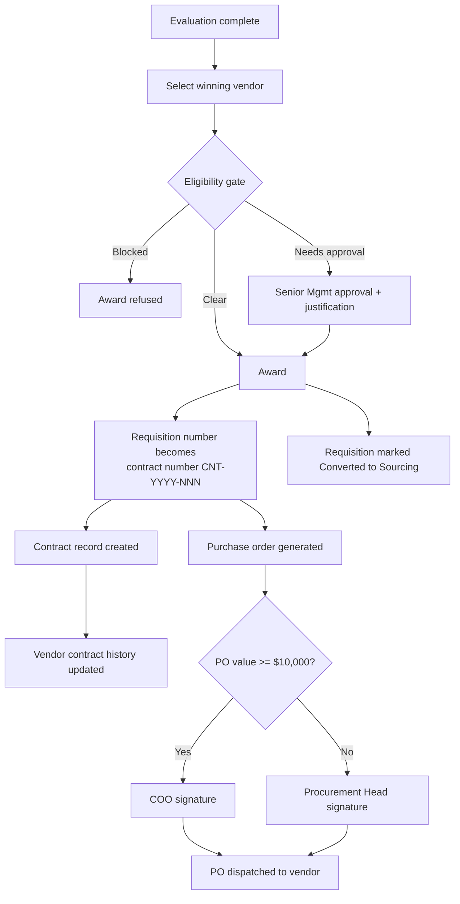
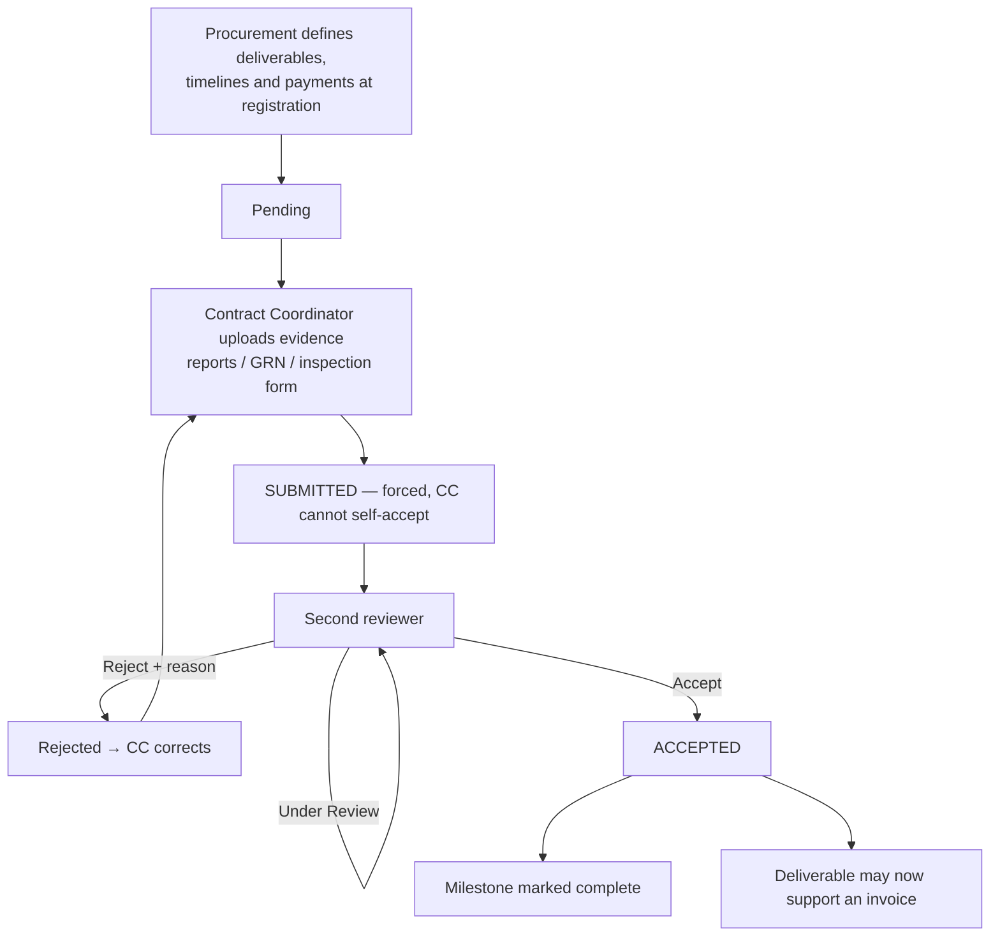
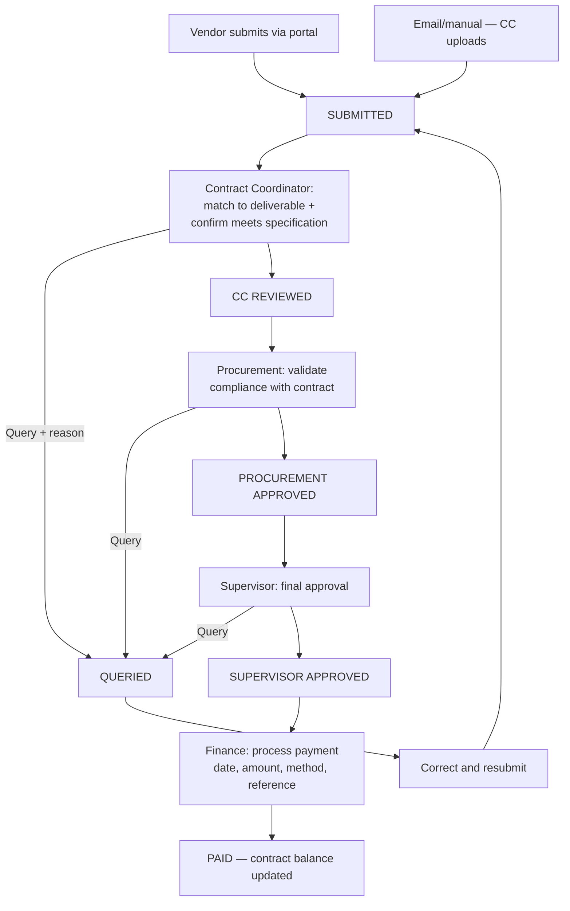
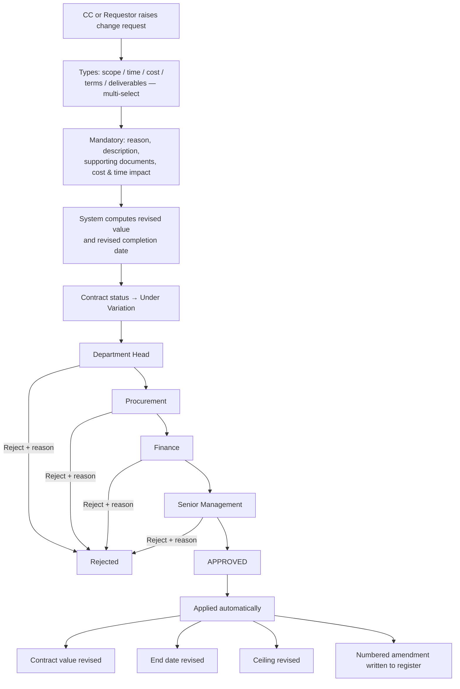
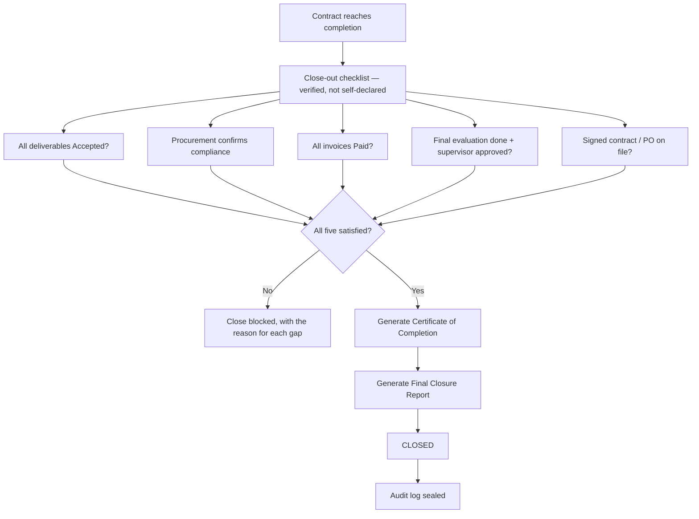

# ACET ERP — Procurement Module: End-to-End Process Flows

This document is the authoritative process map for the procurement module. It traces every
flow from origination to close-out, names the actor at each station, states the control that
must be satisfied before the process can advance, and points at the code that enforces it.

The golden thread runs:

```
Procurement Plan → Requisition → Sourcing → Award → Contract → Deliverables → Invoice → Payment → Close-Out → Vendor Rating
```

Every record downstream carries the reference of the record upstream, so any payment can be
traced back to the plan line that authorised it.

---

## Contents

1. [Cross-cutting foundations](#0-cross-cutting-foundations)
2. [Flow 1 — Procurement planning](#flow-1--procurement-planning)
3. [Flow 2 — Purchase requisition](#flow-2--purchase-requisition)
4. [Flow 3 — Vendor onboarding and lifecycle](#flow-3--vendor-onboarding-and-lifecycle)
5. [Flow 4 — Sourcing: Open Competition](#flow-4--sourcing-open-competition)
6. [Flow 5 — Sourcing: Limited Competition](#flow-5--sourcing-limited-competition)
7. [Flow 6 — Sourcing: Direct Selection](#flow-6--sourcing-direct-selection)
8. [Flow 7 — Sourcing: Request for Quotation](#flow-7--sourcing-request-for-quotation)
9. [Flow 8 — Electronic bid submission](#flow-8--electronic-bid-submission-vendor-portal)
10. [Flow 9 — Award, purchase order and contract creation](#flow-9--award-purchase-order-and-contract-creation)
11. [Flow 10 — Contract registration and setup](#flow-10--contract-registration-and-setup)
12. [Flow 11 — Deliverable submission and acceptance](#flow-11--deliverable-submission-and-acceptance)
13. [Flow 12 — Invoice to payment](#flow-12--invoice-to-payment)
14. [Flow 13 — Contract change management](#flow-13--contract-change-management-variations)
15. [Flow 14 — Vendor performance evaluation](#flow-14--vendor-performance-evaluation)
16. [Flow 15 — Contract close-out](#flow-15--contract-close-out)
17. [Flow 16 — Reporting and analytics](#flow-16--reporting-and-analytics)
18. [Exception paths](#exception-paths)
19. [Traceability matrix](#traceability-matrix)

---

## 0. Cross-cutting foundations

These four services underpin every flow below.

### 0.1 Identity and permissions — `lib/currentUser.ts`

Nine roles: Requestor, Department Head, Procurement, Finance, Senior Management, Contract
Coordinator, Supervisor, Audit, Vendor. Each holds a set of capabilities (`plan.reviewFinance`,
`contract.invoiceSupervisorApprove`, and so on). Controls call `can(capability)` to enable
themselves and `denialReason(capability)` to explain why they are locked.

Two separation-of-duty rules are enforced in the store, not the UI, so no screen can bypass them:

- A Contract Coordinator cannot review or accept a deliverable they submitted themselves.
- The supervisor approving an invoice cannot be the person who performed the coordinator review.

The role switcher in the top navigation moves the acting identity between stations so a single
session can walk a request through all five approvals.

### 0.2 Notifications, reminders and escalation — `lib/notificationStore.ts`

Every stage transition dispatches a notification recording its channels (In-App, Email, SMS),
recipient, priority and the record it concerns. Where a stage is *waiting* on somebody, a
reminder is scheduled alongside it:

| Waiting on | First reminder | Escalates to | After |
|---|---|---|---|
| Requisition approval (any station) | 48h | Senior Management | 72h |
| Invoice coordinator/procurement review | 48h | Procurement / Senior Mgmt | 72h |
| Invoice payment | 72h | Senior Management | 120h |
| Plan item review | 48h | Senior Management | 72h |
| Contract deliverable | 7 days | Procurement | 14 days |
| Vendor document expiry | 24h | — | 14 days |
| Contract expiry | 7 days | — | 30 days |

`runReminderSweep()` materialises due reminders and escalates the unanswered ones. It runs on
app load and every 60 seconds thereafter. Completing the awaited action calls `resolveReminder`,
which stops the chase. The full delivery record is visible at **Procurement → Notifications &
Reminders**.

### 0.3 Value thresholds — `lib/procurementThresholds.ts`

Four canonical methods, with the value bands that suggest them:

| Method | Value band (USD) | Justification required |
|---|---|---|
| Direct Selection | up to $5,000 | Always |
| Request for Quotation | $5,000 – $50,000 | No |
| Limited Competition | $50,000 – $200,000 | Always |
| Open Competition | above $200,000 | No |

The system *suggests*; Procurement may override, but a deviation must carry a written
justification. Two further thresholds apply: requisitions above **$10,000** route to Senior
Management, and purchase orders at or above **$10,000** must be signed by the COO.

`canonicalMethod()` folds legacy vocabulary ("Competitive Bidding", "Single Source", "Direct
Purchase", "Framework Agreement") onto the four official methods so Planning, Requisitions and
Sourcing all speak one language.

### 0.4 Audit trail

Contracts carry a full `auditLog`; requisitions carry `approvalHistory`; plan items carry
field-level `changeHistory` with old and new values; vendors carry `statusHistory`. Every entry
records the real acting user, the date and a reason.

---

## Flow 1 — Procurement planning

**Requirement:** BR001 · **Screen:** Procurement Plan · **Code:** `components/ProcurementPlanView.tsx`, `lib/procurementStore.ts`

Nothing may be procured that is not on an approved plan. This flow is what puts it there.



### Steps

| # | Actor | Action | System behaviour |
|---|---|---|---|
| 1 | Requestor / Dept / Finance / Procurement | Create plan entry | Captures activity description, category (Goods/Services/Works/Consultancy), estimated value, donor/funding source, procurement method, initiation → award → completion dates, responsible person, department, budget line, work plan. Auto-generates `PP-2026-NNN`. |
| 2 | System | Suggest method | `suggestProcurementMethod(value)` pre-fills the method and displays the bands. Override is allowed but demands `methodDeviationJustification`. |
| 3 | Originator | Submit for review | `submitPlanItemForReview()` → status **Pending Procurement Review**. Notifies Procurement, schedules a 48h reminder. |
| 4 | Procurement | Compliance review | `reviewPlanItemProcurement()` → **Pending Finance Review**. Notifies Finance. |
| 5 | Finance | Budget verification | `reviewPlanItemFinance()` → **Approved**. Notifies the responsible person. |
| — | Either reviewer | Reject | `rejectPlanItem()` requires a written reason; item returns to **Rejected** and can be corrected and resubmitted. |

### Controls

- An item only appears in the requisition plan-item dropdown once `approvalStatus === "Approved"` (`getApprovedPlanItems()`).
- **Amendments to an approved item do not apply immediately.** `requestPlanItemChange()` holds them as a `pendingChange` until Procurement *and* Finance approve, then writes them with full version history and both approvers' names stamped on the change record.
- `detectOverduePlanItems()` runs on load, compares `completionDate` to today, flips slipped items to **Delayed** and raises an alert. This is automatic — it does not depend on anyone setting a status by hand.

### Exit

An approved plan item, live on the portal, available to Flow 2.

---

## Flow 2 — Purchase requisition

**Requirement:** BR001 · **Screens:** Purchase Requisitions, ESS Procurement Plan, four approval queues · **Code:** `components/PurchaseRequisitionManagement.tsx`, `pages/ESSProcurementPlan.tsx`, `lib/procurementStore.ts`



### The validation gate — `validatePRForSubmission()`

Submission is **blocked** with field-level messages until every one of these holds:

1. Title, description, department, estimated cost, funding source and category are present.
2. Goods carry a delivery timeline; Services/Works/Consultancy carry start and end dates, in the right order.
3. The requisition is linked to an **approved** plan activity — or carries an approved emergency override with a written justification.
4. The chosen method matches its value band, or a deviation justification is recorded.
5. Direct Selection carries a justification *and* the supplier's full legal name, registered address and email. Limited Competition carries its shortlist.
6. At least one mandatory document is attached — TOR for services, Technical Specifications for goods.
7. The funding source matches the linked plan item's funding source.

### Statuses

`Draft → Submitted → Pending Dept Approval → Pending Procurement & Finance → Pending Senior Mgmt → Approved → Converted to Sourcing`, plus `Rejected` and `Withdrawn`.

### Controls

- **Parallel approval.** Procurement and Finance review concurrently; the requisition advances only when both have approved (`handleParallelAdvance`).
- **Threshold routing.** `requiresSeniorApproval` is set from the $10,000 threshold; step 5 is skipped below it.
- **Rejection is never silent.** Every reject function refuses an empty reason and returns an error.
- **Rejection is not terminal.** `resubmitPR()` re-runs the full validation gate and returns the requisition to department approval, incrementing `resubmissionCount` and preserving the history of what was rejected and why.
- **Plan variance.** `checkPlanVariance()` flags a requisition costing more than 10% above its plan item; the requester must comment, and the flag is surfaced to every approver.
- **Real days-in-stage.** `computeDaysInStage()` derives from `stageEnteredDate`, so the tracker is live rather than a seeded number.

### Exit

An approved requisition, which auto-creates a sourcing case (Flow 4–7) and is then marked
**Converted to Sourcing** with the case number.

---

## Flow 3 — Vendor onboarding and lifecycle

**Requirement:** BR002 · **Screens:** Supplier Management, Vendor Portal · **Code:** `lib/vendorStore.ts`, `components/Suppliers.tsx`, `components/VendorPortal.tsx`



### Registration

Two routes, one record: self-registration through the vendor portal, or internal creation by
Procurement. Both call `registerVendor()`, which issues the next `VND-NNNN` identifier (firms
from 1000, individuals from 2000 — the counter genuinely increments), stores the documents with
their expiry dates, and returns the screening flags.

**Corporate entities** capture legal name, registration number, TIN, registered address,
contacts, ownership details, bank account, specialisation and category, with Certificate of
Incorporation, Tax Clearance, SSNIT Clearance, VAT Registration, Performance References and
Policy Compliance Form. **Individual consultants** capture full legal name, contacts, TIN, areas
of specialisation and bank details, with CV, national ID or passport, proof of residential
address and bank confirmation.

### Automatic screening — `getVendorFlags()`

- **Duplicate detection** — normalises away suffixes (Ltd, Inc, GH…) and matches against the register.
- **Sanctions screening** — checks the debarment list; a hit raises an Urgent notification and blocks approval.
- **Document expiry** — expired, expiring-within-30-days and missing documents are each surfaced.
- **Risk scoring** — `computeRiskLevel()` recomputes Low/Medium/High on every mutation from performance, document compliance, status and sanctions.
- **Renewal reminders** — `syncDocumentExpiryReminders()` queues a chase for every critical document within 60 days of expiry.

### The eligibility gate — `checkSourcingEligibility()`

This is the single function Sourcing consults before any invitation or award:

| Condition | Result |
|---|---|
| Blacklisted, Suspended, sanctioned, Pending Onboarding, Pending Reactivation | **Blocked** — cannot be invited or awarded |
| Flagged, performance below 5/10, expired compliance documents | **Allowed with Senior Management approval** |
| Missing documents, unvalidated banking, documents expiring soon | Warning shown, engagement permitted |

### Exit

An Active vendor selectable in Sourcing, whose rating and contract history are visible in both
the supplier profile and the contract record.

---

## Flow 4 — Sourcing: Open Competition

**Requirement:** BR003 · **Code:** `components/Sourcing.tsx`, `components/SourcingCaseDetail.tsx`, `lib/tenderPortalStore.ts`

Applies to Goods, Services and Works above the Open Competition threshold.



### Steps

| # | Step | Actor | Detail |
|---|---|---|---|
| 1 | Solicitation documents | Procurement | Uploads ITB (goods) or REOI/RFP (services) plus the evaluation criteria matrix and draft contract. Real file upload with version history. |
| 2 | Advertisement | Procurement | `publishTender()` posts to the vendor portal and records the channels (ACET website, newspapers, donor portals) with dates and references. This is what makes the tender visible in Flow 8. |
| 3 | EOI evaluation & shortlisting | Procurement + evaluators | Services only. Bidders are scored and a shortlist recorded, which carries into step 4. |
| 4 | Invitation | Procurement | Selects shortlisted bidders from the vendor database — gated by `checkSourcingEligibility()` — or registers a new vendor inline. Specifies whether technical, financial or both proposals are required. For individual consultants this may instead be an interview invitation. |
| 5 | Electronic submission | Vendors | See Flow 8. Sealed on arrival. |
| 6 | Bid opening | Procurement | `openEnvelope()` — refuses while the tender is still open. Technical and financial envelopes open separately. Opening minutes and attendance uploaded; electronic bids auto-populate alongside manually recorded ones. Stakeholders notified. |
| 7 | Evaluation & approvals | Evaluation panel | Combined evaluation report (services), evaluation report (goods) or interview scores (individuals). |
| 8 | Negotiation | Procurement | Optional and skippable; minutes uploaded where held. |
| 9 | Award | Procurement | See Flow 9. |

### Controls

- No vendor blocked by the eligibility gate can be invited or awarded.
- A financial envelope cannot be opened before the tender closes, and technical scoring can be
  completed before prices are revealed.
- Every stage transition notifies the requester and the internal stakeholders.

---

## Flow 5 — Sourcing: Limited Competition

Identical to Flow 4 with **no advertisement step** — the tender is published to the invited
shortlist only (`invitedVendorIds`), so it appears in the portal solely for those vendors.
Justification for restricting the market is required at the requisition stage.

Steps: Solicitation documents → Invitation to shortlisted bidders → Electronic submission →
Bid opening → Evaluation & approvals → Negotiation (optional) → Award.

---

## Flow 6 — Sourcing: Direct Selection

Single-source procurement. No advertisement; the invitation step becomes "Select Vendor" with a
single-choice picker.

**Evaluation is optional here** and can be skipped, which matches the requirement — a direct
selection has no competing bids to evaluate. Negotiation remains optional.

Steps: Solicitation documents → Select vendor → Submission (optional) → Bid opening →
Evaluation (**optional**) → Negotiation (optional) → Award.

A written justification for direct selection, plus the supplier's full legal identification, is
mandatory upstream at the requisition gate.

---

## Flow 7 — Sourcing: Request for Quotation

For goods and services in the RFQ band.

Steps: **Invitation (optional)** → Quotation submission (optional electronic) → Bid opening →
Evaluation & approvals → Negotiation (optional) → Award / Purchase Order.

Both the invitation and the submission steps are optional, matching the requirement that
quotations may be solicited informally. Award typically issues a Purchase Order rather than a
signed contract (Flow 9).

---

## Flow 8 — Electronic bid submission (Vendor Portal)

**Requirement:** BR003 · **Screen:** Procurement → Vendor Portal · **Code:** `lib/tenderPortalStore.ts`, `components/VendorPortal.tsx`



### Guarantees

- **Unique identity** — every submission gets a submission ID and an acknowledgement reference.
- **Sealed until opening** — `locked: true` on arrival; only `openEnvelope()` unseals, and only after the tender closes.
- **Audit trail** — timestamp, source IP, document count and opener are all recorded. `getSubmissionTimestampReport()` produces the timestamps report, exportable to Excel or PDF.
- **Restricted tenders** — a vendor not on `invitedVendorIds` cannot see or submit to a Limited or Direct tender.
- **Eligibility** — only Active vendors may submit; suspended and blacklisted accounts are refused with an explanation.
- **No duplicate envelopes** — one technical and one financial envelope per vendor per tender; replacing requires withdrawing first, and only while the tender is open.
- **Individual consultants** may attach a proposed daily or monthly rate where the tender requests it; the accepted rate is written to their rate history on award.

The portal also carries vendor self-registration (Flow 3), compliance document upload, profile
change requests that go to Procurement for review rather than editing the live record, invoice
submission against a contract (Flow 12), submission history and notifications.

---

## Flow 9 — Award, purchase order and contract creation



The requisition number converts directly into the contract number
(`generateContractNumber()`), which is what preserves the audit thread from plan to payment.
`registerAwardWithVendor()` writes the award into the vendor's contract history and totals.

---

## Flow 10 — Contract registration and setup

**Requirement:** BR004 · **Screen:** Contract Management · **Code:** `components/ContractManagement.tsx`, `lib/contractStore.ts`

A five-step wizard captures:

1. **Identity** — title, auto-derived contract number, vendor, category, method, department, owner, funding source and budget line.
2. **Commercial terms** — Lump Sum or Time Based. Time-based contracts carry a rate frequency (daily, weekly, monthly, quarterly) and a **maximum amount** ceiling.
3. **Schedule** — delivery schedule for goods (item, quantity, expected date) or milestones and deliverables for services.
4. **Payments** — a payment schedule tied to deliverables or timelines, validated against the contract value.
5. **Documents and coordinators** — the signed contract or PO uploaded for real, and up to **three** Contract Coordinators assigned (hard-capped) who receive all contract notifications.

Registering seeds one Pending deliverable per milestone and schedules the deliverable and
expiry reminders.

**Contracts arriving from a Sourcing award** are created as a shell (vendor, value, dates). The
module detects this and offers "Complete contract setup", which opens the same wizard in edit
mode and saves through `enrichContract()` — so an awarded contract can always be brought up to a
manageable state.

---

## Flow 11 — Deliverable submission and acceptance



### Controls

- The status on submission is **forced to "Submitted"** regardless of what the form offers — a
  coordinator cannot mark their own upload Accepted.
- `reviewDeliverable()` **refuses** when the reviewer is the submitter.
- Rejection requires comments.
- Accepting the evidence marks the linked milestone complete.
- Goods and works additionally capture goods-received and inspection-passed confirmations.
- Reminders chase upcoming deliverables 7 days out and escalate to Procurement at 14 days
  overdue.

---

## Flow 12 — Invoice to payment

**Requirement:** BR004 (the critical control) · **Code:** `lib/contractStore.ts`



### Gates — each enforced in the store, so no screen can skip a stage

| Gate | Rule |
|---|---|
| On receipt | Invoice number required, unique per contract; amount > 0; total invoiced may not exceed the contract ceiling (or the revised ceiling after an approved variation) — otherwise a cost variation must be raised first. |
| Coordinator review | **A deliverable link is mandatory**, the deliverable must be in **Accepted** state, and the coordinator must tick "meets contract specifications". |
| Procurement review | Only from **CC Reviewed**. Validates compliance with contract terms. |
| Supervisor approval | Only from **Procurement Approved**, and **not by the person who did the coordinator review**. |
| Payment | Only from **Supervisor Approved**. Payment date, actual amount paid, method and a **reference number** are all required. |

Marking an invoice Paid updates `totalPaid` and the remaining balance
(`getContractFinancials()`). Any reviewer may **query** an invoice back to the vendor with a
documented reason; `resubmitInvoice()` returns it to the start of the chain. Every transition is
recorded in `approvalHistory` and the contract audit log.

---

## Flow 13 — Contract change management (variations)



A change request follows **the same approval chain as a fresh procurement**, in strict order.
Amendments are numbered 1, 2, 3… sequentially. Supporting documents are **mandatory** — the
store rejects a change request without them. `computeRevisedEndDate()` parses time impacts
("3 months", "2 weeks", "14 days") into a real revised date, shown live as the user types.

Once the chain completes, `implementChangeRequest()` writes the change into the contract:
revised value, revised end date, revised ceiling for time-based contracts, and a formal entry in
the amendment register recording old and new values. The contract returns to Active unless
another variation is still pending. Finance is notified so the budget and payment schedule can
be revised.

---

## Flow 14 — Vendor performance evaluation

Conducted at **mid-term** (for long-duration and time-based contracts) and at **final
completion** for every contract.

Five default criteria on a **10-point scale** — quality of deliverables, timeliness, cost
control, compliance with terms, professionalism and responsiveness — which can be renamed,
added to or removed. **Two approvals** are required: the Contract Coordinator evaluates and the
supervisor approves, and the store refuses an evaluation where the supervisor is the evaluator.

On submission, `addPerformanceEvaluation()` pushes the scorecard into the vendor profile via
`recordVendorEvaluation()`, which:

- appends it to the vendor's evaluation history, visible in both Contract Management and Supplier Management;
- recomputes the headline performance score as the mean across all evaluations, normalised to 10 points so a re-weighted template still averages correctly;
- recomputes the risk level;
- **automatically flags any vendor scoring below 5**, after which engagement requires Senior Management approval through the eligibility gate in Flow 3.

That closing of the loop — a poor score on a contract actually blocking the next award — is what
makes the rating consequential rather than decorative.

---

## Flow 15 — Contract close-out



`verifyCloseOutReadiness()` computes four of the five conditions from actual contract state and
explains each — "3 outstanding: …", "2 invoices not yet paid: INV-…", "Final evaluation awaiting
supervisor approval". Only *Procurement confirms compliance* is a manual tick. `closeContract()`
refuses while any condition fails and names them.

The Certificate of Completion and the Final Closure Report (contract summary, deliverables
completion, payment summary, performance summary, change-management summary, key dates) are
generated and printable to PDF.

---

## Flow 16 — Reporting and analytics

**Requirement:** BR007 · **Code:** `components/ProcurementReportingAnalytics.tsx`

Six report families, all computed from live store data, all filterable by period (monthly,
quarterly, annually, custom range) and all exportable to **Excel (.xls)**, **PDF** and **CSV**:

| Family | Reports |
|---|---|
| Planning & orders | Plan status; budget utilisation (planned vs committed vs spent); pipeline; pending/approved/rejected requisitions |
| Sourcing & contracts | Sourcing status; bid submission; active contracts; deliverables status; invoice & payment; variations; close-out |
| Vendors & KPIs | Vendor master list; performance evaluation; prequalification; cycle time; efficiency; vendor responsiveness; payment timeliness |
| Contract-specific | Contract summary; deliverables tracking; variations; performance scorecard; contract risk; expiry at 30/60/90 days |
| Donor | Procurement summary per donor; budget utilisation per donor |
| Combined | Vendor performance on donor-funded contracts; spend per donor by vendor; top performers per funding source; compliance per donor |

**Contract risk** is derived rather than declared: overdue deliverables, repeated invoice
queries, excessive variations, scope creep, cost growth above 20%, approaching expiry and poor
performance scores each contribute, producing a Low/Medium/High severity.

---

## Exception paths

| Exception | Mechanism | Control |
|---|---|---|
| Urgent need not on the plan | Emergency override on the requisition | Written justification, Senior Management authorisation, Urgent notification to Audit, permanently visible on the record |
| Method outside its value band | Deviation justification | Required before submission; shown to every approver |
| Requisition rejected | Correct and resubmit | Full validation gate re-runs; resubmission count and prior rejection reason retained |
| Requisition no longer needed | Withdraw with reason | Blocked once approved — cancellation must go through Procurement |
| Cost above the plan item | Plan variance flag | Comment required from the requester; flag shown to all approvers |
| Vendor flagged or poorly performing | Eligibility gate | Engagement permitted only with Senior Management approval |
| Vendor suspended or blacklisted | Eligibility gate | Blocked outright from invitation and award |
| Invoice disputed | Query with reason | Returns to the vendor; resubmission restarts the chain |
| Contract needs to change | Change request | Same four-station approval chain as a fresh procurement |
| Approval stalls | Reminder + escalation | 48h reminder, 72h escalation to Senior Management |

---

## Traceability matrix

| Requirement | Flow | Primary code |
|---|---|---|
| BR001 Procurement planning | 1 | `lib/procurementStore.ts`, `components/ProcurementPlanView.tsx` |
| BR001 Purchase requisition | 2 | `lib/procurementStore.ts`, `components/PurchaseRequisitionManagement.tsx` |
| BR002 Supplier management | 3 | `lib/vendorStore.ts`, `components/Suppliers.tsx` |
| BR003 Sourcing — all four methods | 4–7 | `components/Sourcing.tsx`, `components/SourcingCaseDetail.tsx`, `lib/procurementThresholds.ts` |
| BR003 Online submission portal | 8 | `lib/tenderPortalStore.ts`, `components/VendorPortal.tsx` |
| BR004 Contract registration | 9–10 | `lib/contractStore.ts`, `components/ContractManagement.tsx` |
| BR004 Deliverables | 11 | `lib/contractStore.ts` |
| BR004 Invoices & payment | 12 | `lib/contractStore.ts` |
| BR004 Change management | 13 | `lib/contractStore.ts` |
| BR004 Performance measurement | 14 | `lib/contractStore.ts` → `lib/vendorStore.ts` |
| BR004 Close-out | 15 | `lib/contractStore.ts` |
| BR007 Reporting & analytics | 16 | `components/ProcurementReportingAnalytics.tsx`, `lib/exportUtils.ts` |
| Cross-cutting: roles & permissions | 0.1 | `lib/currentUser.ts` |
| Cross-cutting: notifications & escalation | 0.2 | `lib/notificationStore.ts` |
| Cross-cutting: thresholds | 0.3 | `lib/procurementThresholds.ts` |

---

## How these flows were verified

Three gates, all currently green.

**1. Compile and build.** `npm run build` (`tsc -b && vite build`) completes with zero TypeScript
errors across the whole project.

**2. Behavioural checks against the real stores — 88 of 88 passing.** Every control described above
was exercised directly, including the negative cases that matter most:

- A plan item is not visible to requisitions until *both* review stations have passed it.
- An amendment to an approved plan item does not change the item until Procurement *and* Finance approve, and the change history then carries both approvers' names.
- The requisition validation gate blocks and names each missing element; the chain does not advance on one parallel approval alone; a blank rejection reason is refused; a rejected requisition can be corrected and resubmitted; an approved one cannot be withdrawn.
- A blacklisted vendor is blocked from sourcing; a flagged one is allowed only with management approval; a debarred name is caught by sanctions screening at registration; a self-registration cannot be sourced until approved.
- A bid arrives sealed, the envelope refuses to open while the tender is still accepting bids, and a closed tender refuses further submissions.
- A coordinator cannot accept their own deliverable.
- **The invoice chain refuses every shortcut**: payment before approval, coordinator review without a deliverable link, coordinator review without the specification confirmation, supervisor approval before procurement, supervisor approval by the same person who did the coordinator review, payment without a reference number, and an invoice that would breach the contract ceiling.
- A change request without supporting documents is refused; the four approvals must be taken in order; the fourth applies the revised value, end date and numbered amendment.
- A sub-5 evaluation automatically flags the vendor, and their next engagement then requires management approval — the loop from performance back to eligibility closes.

**3. Runtime.** Every procurement screen was loaded in the running application and renders live
store data with no console errors: Dashboard, Supplier Management, Purchase Requisitions, Sourcing,
Purchase Orders, Invoices, Contract Management, Contract Repository, Vendor Portal, Notifications &
Reminders, plan approvals, and all six report families.

One thing the verification surfaced that is worth knowing rather than fixing: **Office Depot Ltd.'s
seeded tax clearance certificate expired on 2026-07-20**, so the expired-document rule correctly
requires management approval before that vendor can be engaged. That is the control working, not a
data error — but it is the kind of thing to expect when demonstrating the eligibility gate.
